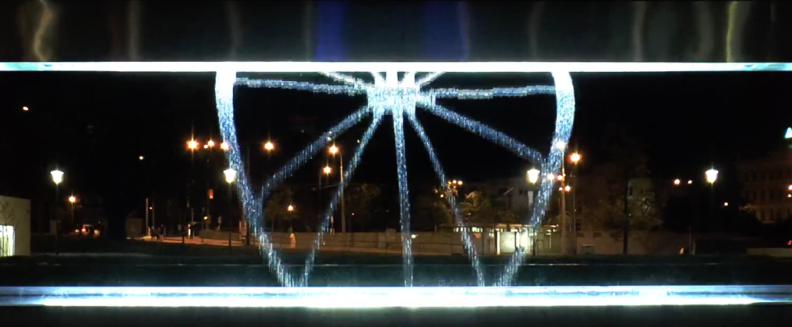
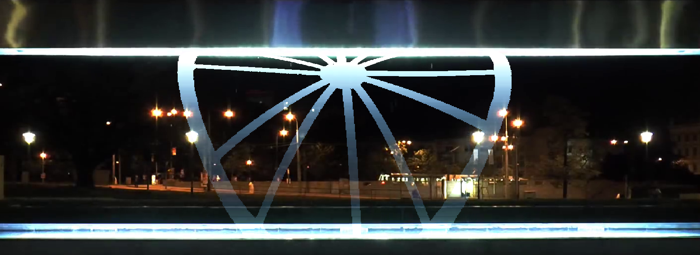

# Fountain Simulator

*Reality:*

*Simulation:*

## Features
- Easy to use visualization of images for the fountain
- Supports multiple bitmap images in arbitrary sequence
- Focus on any part of the sequence, pause it, A-B repeat it
- Accurate image distortion
- Semi-accurate rendering

## How to use
- Make sure that you have Java 8 installed
- Download from releases
- Run by double clicking the downloaded .jar file

- Use mouse to drag image files on the screen to add them to the timeline
- Rearrange the image sequence using arrow buttons
- Remove images from the sequence with red `x` button
- Play and pause the animation by clicking the button or by pressing the spacebar
- Scrub on the timeline by dragging with left mouse button
- Create A-B repeat section by dragging with right mouse button on the timeline
